# Sysads-Task2

Give execute permissions to SubTask1.sh and run it. Now if you open the browser and type in soldiers.io/Navy1 it should show:
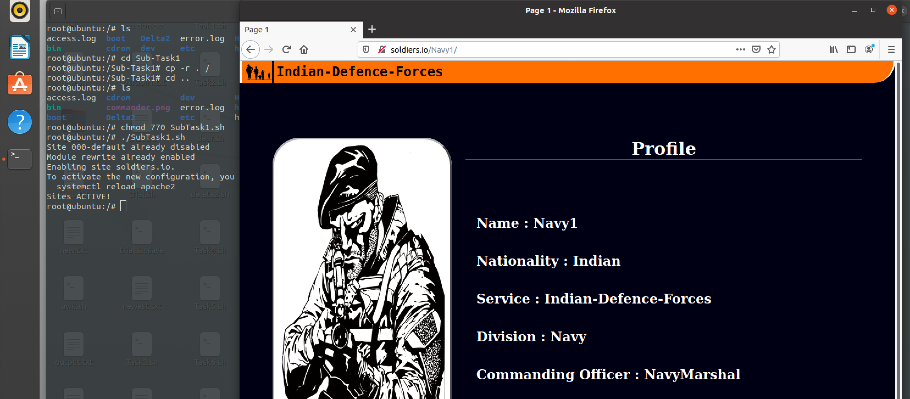

If you don't change the BROWSER_NAME in htaccess1 file then id you go to soldiers.io/ChiefCOmmander you will be redirected to the root directory
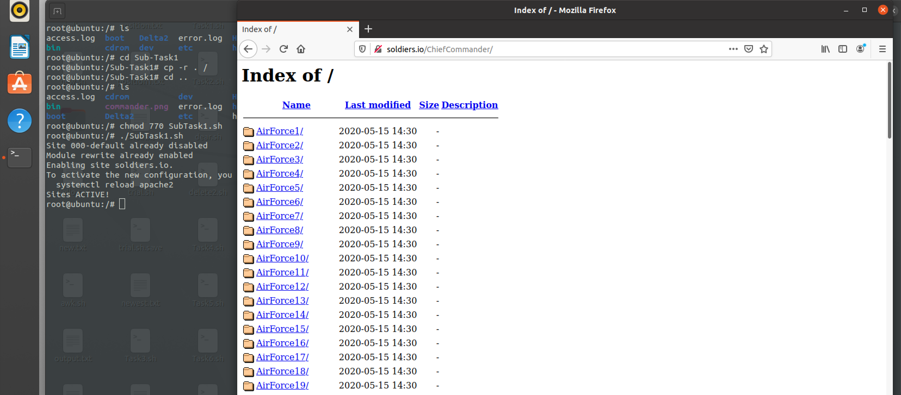

Say if the ChiefCommanders Browser was "Mozilla/5.0" and we make changes in htaccess1:
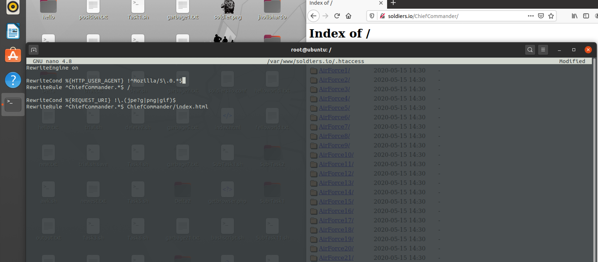

Now once we open the browser and type in soldiers.io/ChiefCommander we get:
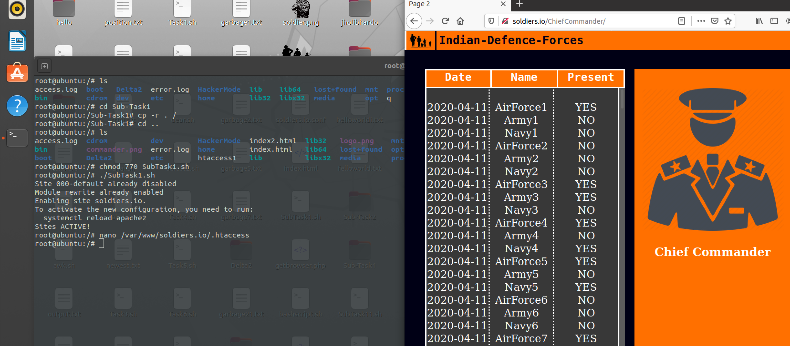

To run the ReverseProxy give execute permissions to ReverseProxy.sh and run it:
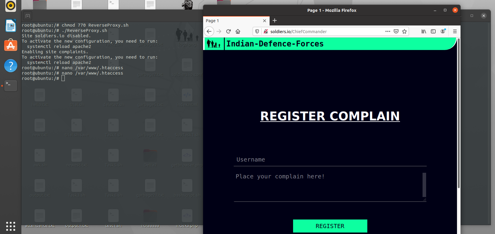

To test the complaint page we first need to create a database so give execute permissions to HackerMode1.sh and change PASSWORD of your root:
Now type in the complains along with the username
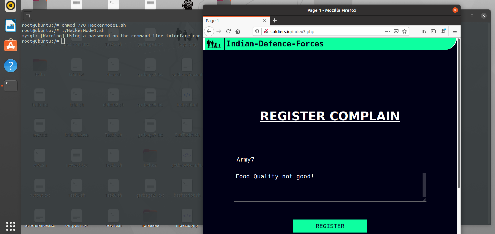

To check the mysql database login as CHiefCommander in mysql:
The database along with the complain has been registered.
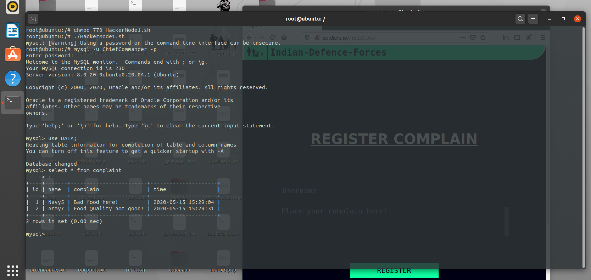

Goto Sub-Task2 directory and type the command "docker build -it sub-task2 . " as root user like this:
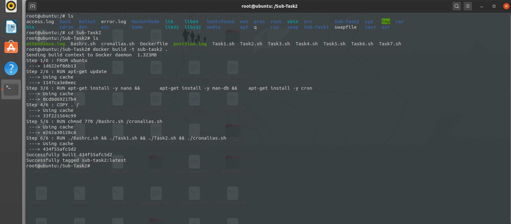

Run the sub-task2 and everything including the crontasks are set:
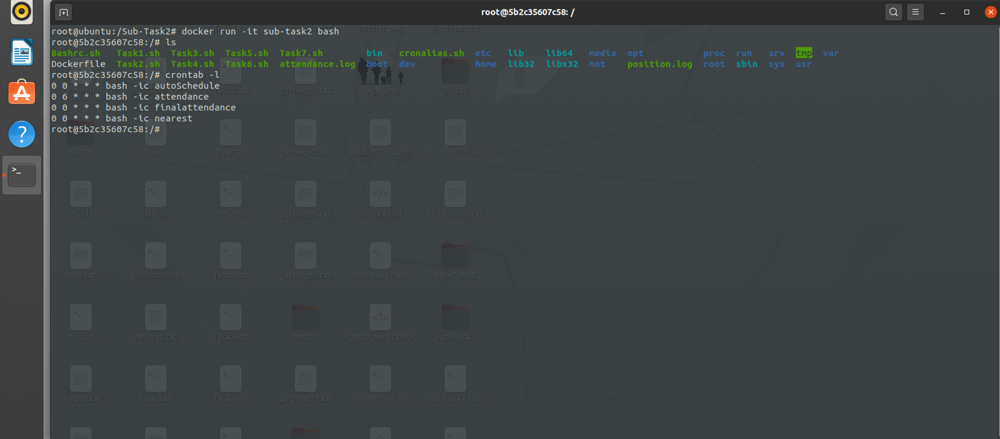

Before build the docker-compose.yml you need to build the apache2 images by going to the Apache directory:
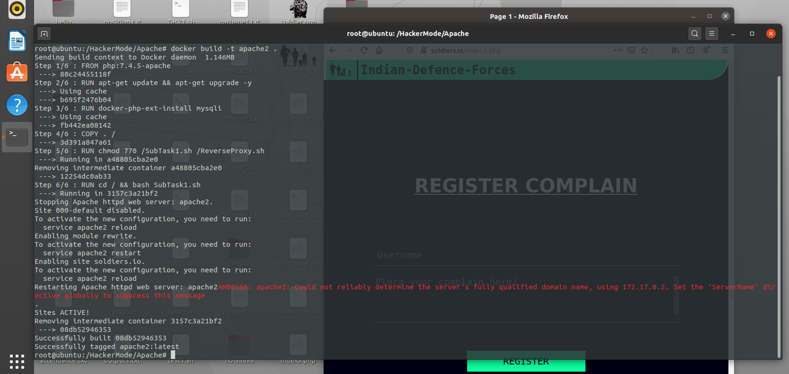

To test this image follow:
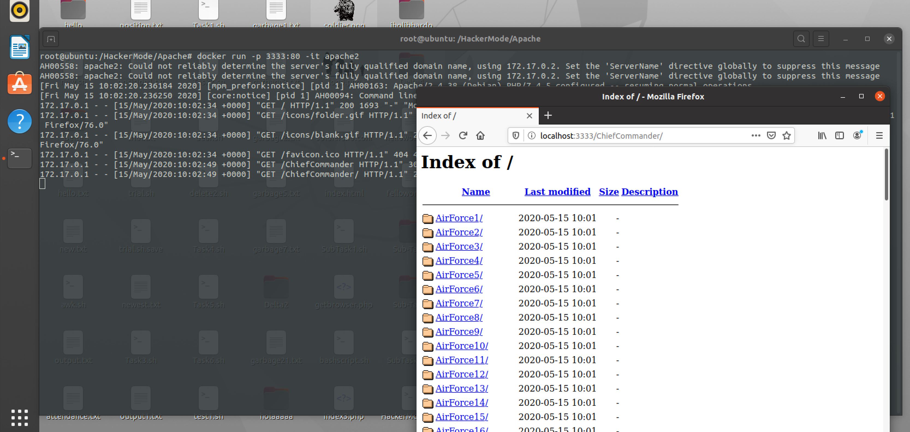
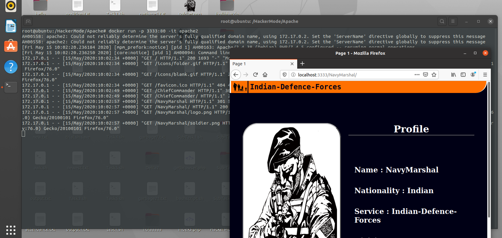

To run the docker-compose.yml file follow:
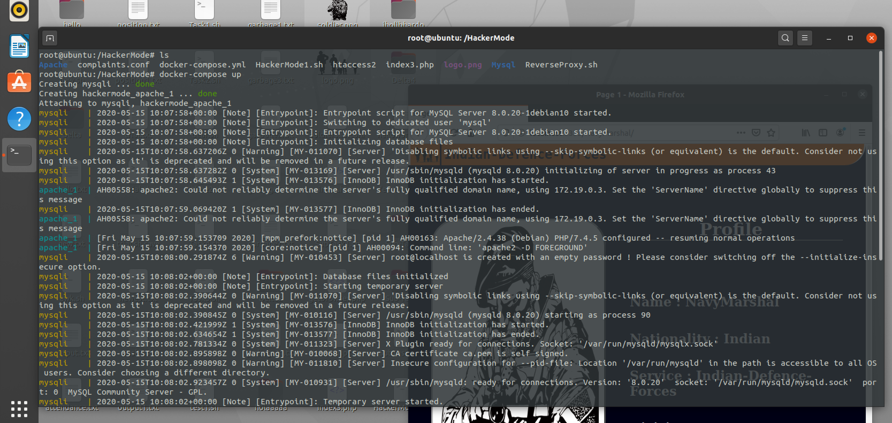

Connect to localhost:3333 to test the application.
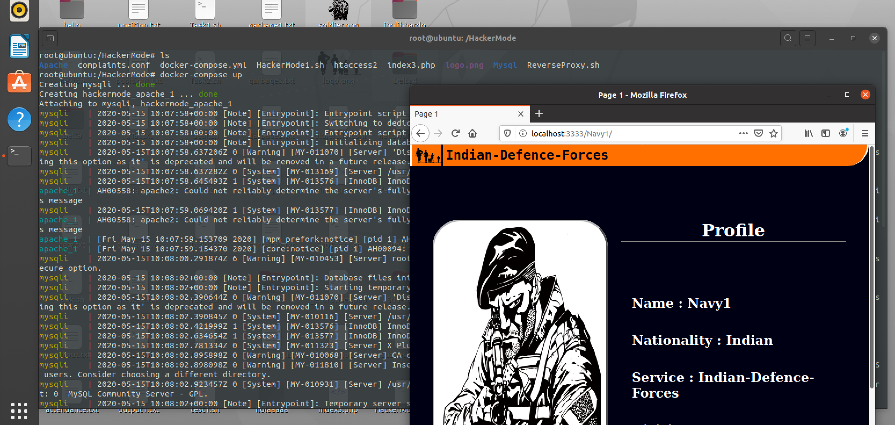

To execute the reverse-proxy in docker-compose.yml you need to rebuild the apache2 image with the following changes in the Dockerfile of Apache:
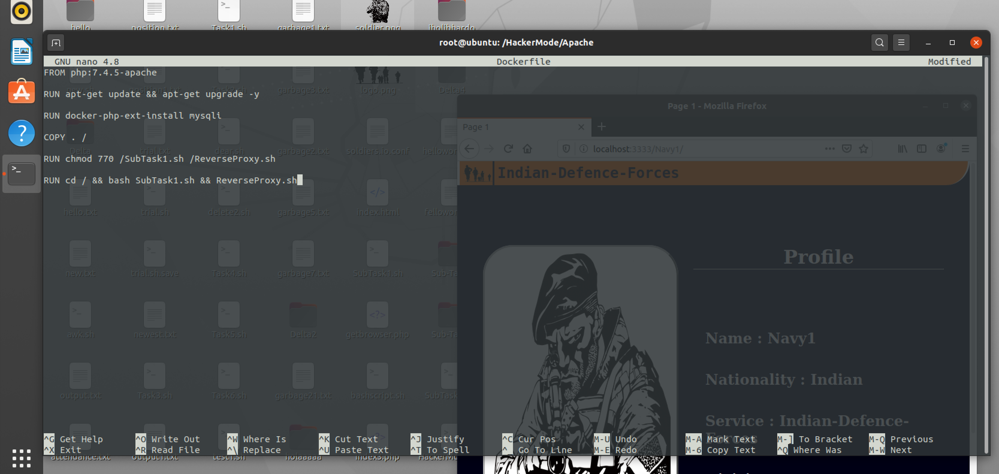

if you don't run "docker-compose up" again and connect to localhost:3000 it won't display the pages:
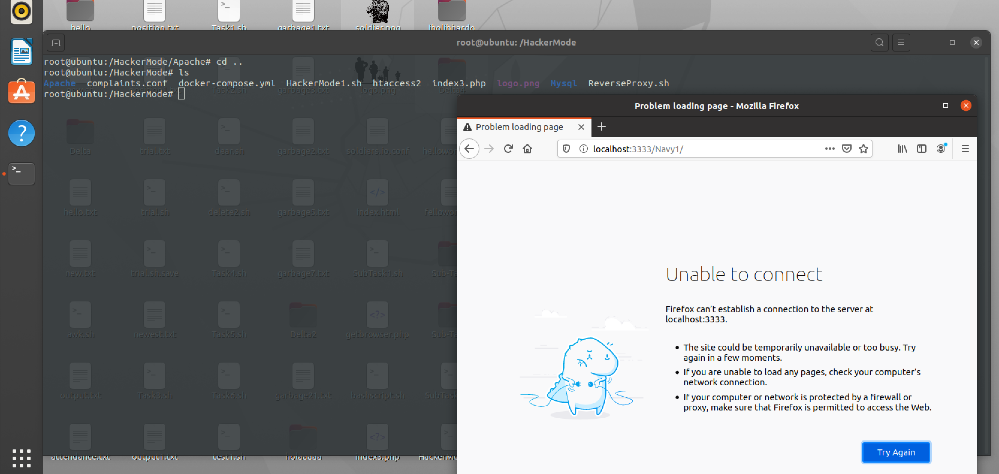

Once you run "docker-compose up" and test it:
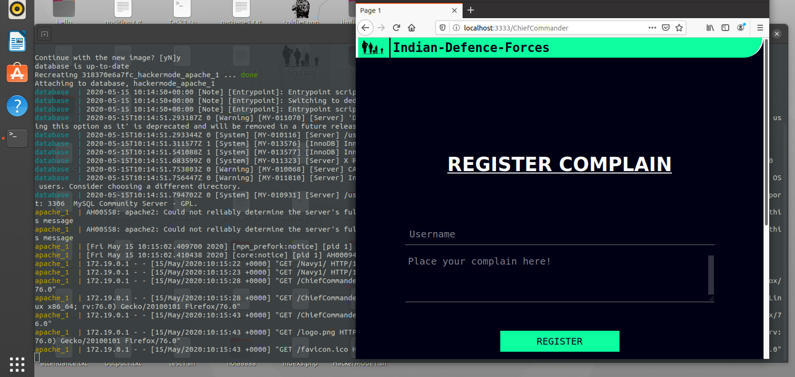
